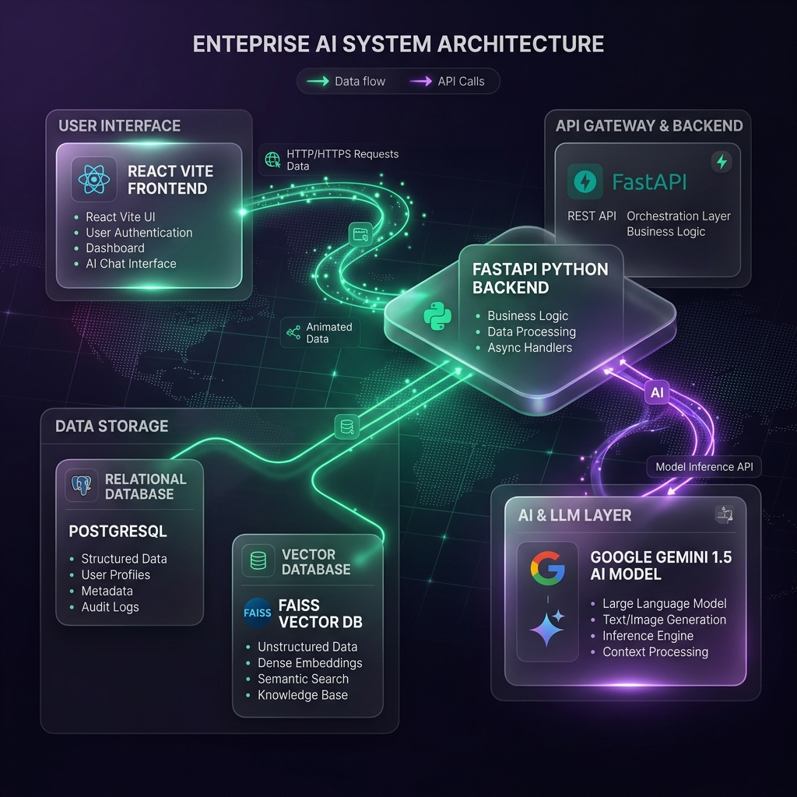

# ManifestIQ


ManifestIQ is an enterprise-grade Supply Chain Document Assistant. It enables teams to upload massive supply-chain documents (shipping manifests, vendor contracts, SLAs) and query them using natural language.

Powered by a Retrieval-Augmented Generation (RAG) architecture, ManifestIQ provides grounded, hallucination-free answers with precise, verifiable source citations.

## 🌟 Key Features

- **Instant Document Indexing**: Upload PDFs and instantly process them through our advanced text extraction and chunking pipeline.
- **AI-Powered Q&A**: Ask natural language questions and get accurate answers powered by Google's state-of-the-art Gemini 1.5 Flash AI model.
- **Advanced Citations**: Every answer traces back to the exact source, displaying Document Name, Page Number, Section, and Chunk ID, along with a Confidence Score.
- **Source Verification**: One-click "View Source" button opens the original PDF anchored to the exact page of the citation.
- **Conversational Memory**: Chat history is preserved so you can ask natural follow-up questions without repeating context.
- **Enterprise UI/UX**: Clean, modern, responsive interface built with React, featuring Dark/Light mode, Framer Motion animations, and beautiful data visualizations using Recharts.
- **Analytics Dashboard**: Real-time metrics tracking Query Volume, Most Queried Documents, Upload Trends, and Retrieval Accuracy.

## 🏗️ Architecture

ManifestIQ is built using a decoupled modern web architecture:



- **Frontend**: React (Vite), Framer Motion, Recharts, Lucide Icons, Vanilla CSS (Design System).
- **Backend**: FastAPI, SQLAlchemy, Uvicorn, Python 3.8+.
- **Database**: PostgreSQL (Relational Data), FAISS (Vector Database).
- **AI / LLM**: Google Generative AI (Gemini 1.5 Flash + Text Embedding 004) REST APIs.

## 🚀 Installation & Deployment

### Prerequisites
- Docker and Docker Compose
- Node.js 18+ (for local frontend development)
- Python 3.8+ (for local backend development)
- A Google Gemini API Key

### Running with Docker (Recommended)

1. Clone the repository and navigate to the project root.
2. Create a `.env` file in the `backend/` directory:
   ```env
   DATABASE_URL=postgresql+pg8000://manifestiq_user:your_secure_password@db/manifestiq
   SECRET_KEY=your-super-secret-jwt-key
   GOOGLE_API_KEY=your_google_gemini_api_key
   POSTGRES_PASSWORD=your_secure_password
   ```
3. Run Docker Compose:
   ```bash
   docker-compose up --build
   ```
4. Access the API at `http://localhost:8000`

### Local Development Setup

**Backend:**
```bash
cd backend
python -m venv venv
source venv/bin/activate  # On Windows: venv\Scripts\activate
pip install -r requirements.txt
uvicorn app.main:app --reload
```

**Frontend:**
```bash
cd frontend
npm install
npm run dev
```
The frontend will be available at `http://localhost:5173`.

## ⚡ Performance Optimization

- **Embeddings**: Utilizes Google's robust REST API for embeddings, bypassing SDK version conflicts and reducing container bloat.
- **Vector Search**: FAISS ensures fast similarity searches for document chunks.
- **Asset Serving**: Uploaded PDFs are efficiently served via FastAPI `StaticFiles` for instant browser rendering during source verification.

## 🧪 Testing

ManifestIQ includes robust routing and error handling:
- `401 Unauthorized`: Automatically intercepts expired JWTs, clears local storage, and redirects to the login screen.
- `404 Not Found` & `500 Server Error`: Beautiful fallback pages for unexpected errors.
- **Form Validation**: Strict email and password requirements enforced on both the client and server.

---

## 🔮 Production Readiness Roadmap

### Critical Fixes
- [x] Fix `citation` → `citations` key mismatch (currently crashes every `/api/query/ask` call)
- [x] Add `GET /api/query/history` (with pagination, search, sorting)
- [x] Add `response_time` column to `QueryLog`; populate from real retrieval time
- [x] Compute dashboard's average response time from real data instead of a hardcoded string
- [x] Fail the upload loudly on embedding errors instead of storing a zero-vector
- [x] Verify Gemini model names against Google's current, live API
- [ ] Rotate any previously-exposed API key

### Backend Hardening
- [x] Replace the hand-rolled embedding wrapper with `langchain-google-genai`'s official class (Note: kept hand-rolled wrapper due to Python 3.8 limitations, but fortified with error handling and logging)
- [x] Consolidate login to a single identifier (email or username) + password
- [x] Move PDF ingestion to background processing (FastAPI `BackgroundTasks` or Celery + Redis)
- [x] Add database indexes: `User.email`, `User.username`, `QueryLog.document_id`, `QueryLog.timestamp`
- [x] Add pagination to Documents, Query History, Analytics
- [x] Add rate limiting on `/login`, `/signup`, `/ask` (e.g. `slowapi`)
- [x] Replace `print()` calls with structured `logging`
- [x] Clean up `requirements.txt` (remove unused `chromadb`/`pysqlite3-binary`, pin `bcrypt`, normalize line endings)
- [x] Restrict CORS from `["*"]` to actual frontend origin(s)

### Frontend Improvements
- [x] Axios interceptor for `401` responses → clean redirect to login with a session-expired message
- [x] Query history detail modal (question, answer, citations, timestamp, response time)
- [x] Dynamic suggested questions in chat (shown before the first message, hidden after)
- [x] Rename "Confidence" to "Relevance Score" (it's a heuristic from vector distance, not a calibrated probability)
- [ ] Skeleton loaders instead of plain loading text
- [ ] Mobile-responsive collapsible sidebar
- [ ] Upload progress indicator

### Production & DevOps
- [x] Pytest coverage for backend (auth, upload, ask, history)
- [ ] React Testing Library coverage for frontend (auth, chat, upload)
- [x] GitHub Actions CI (install → test → lint → build)
- [ ] Docker + Docker Compose for full local stack
- [ ] Health (`/health`) and readiness (`/ready`) endpoints
- [ ] Alembic for database migrations
- [ ] Environment variable validation on startup
- [ ] Structured JSON logging
- [ ] Error tracking (Sentry)

### Advanced AI Features
- [ ] AI-generated document summary (purpose, key topics, important dates/numbers, risks, entities)
- [ ] AI keyword extraction and filtering by keyword
- [ ] Multi-document chat (ask a question across several selected documents at once)
- [ ] Semantic document search (vector search without chat)
- [ ] Conversation memory (follow-up questions without repeating context)
- [ ] Streaming AI responses
- [ ] OCR support for scanned PDFs
- [ ] Export chat (PDF / DOCX / Markdown)
- [ ] User feedback loop (👍 / 👎 on answers)
- [ ] Split-screen PDF preview with highlighted citation text

### Enterprise Features
- [ ] Workspace / folder organization (HR, Finance, Legal, etc.)
- [ ] Shareable document links (read-only, expiring)
- [ ] Role-based access control
- [ ] Admin dashboard (users, storage, errors, server health)
- [ ] User activity and audit logs
- [ ] In-app notifications (upload complete, processing failed, new login)
