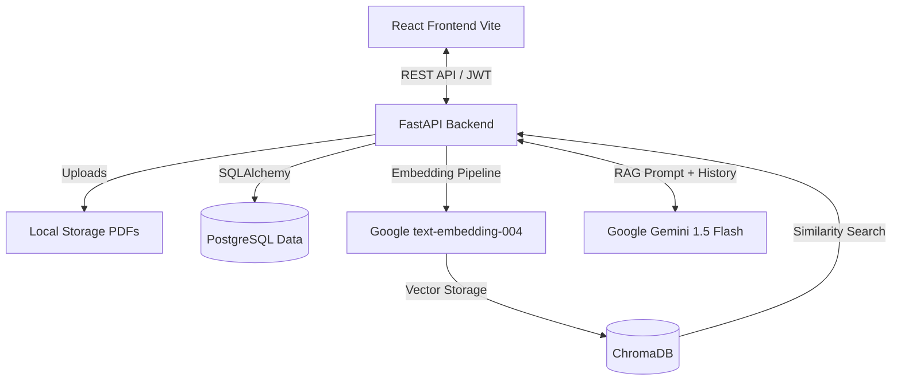

# ManifestIQ


ManifestIQ is an enterprise-grade Supply Chain Document Assistant. It enables teams to upload massive supply-chain documents (shipping manifests, vendor contracts, SLAs) and query them using natural language.

Powered by a Retrieval-Augmented Generation (RAG) architecture, ManifestIQ provides grounded, hallucination-free answers with precise, verifiable source citations.

## 🌟 Key Features

- **Instant Document Indexing**: Upload PDFs and instantly process them through our advanced text extraction and chunking pipeline.
- **AI-Powered Q&A**: Ask natural language questions and get accurate answers powered by Google's state-of-the-art Gemini 1.5 Flash AI model.
- **Advanced Citations**: Every answer traces back to the exact source, displaying Document Name, Page Number, Section, and Chunk ID, along with a Confidence Score.
- **Source Verification**: One-click "View Source" button opens the original PDF anchored to the exact page of the citation.
- **Conversational Memory**: Chat history is preserved so you can ask natural follow-up questions without repeating context.
- **Enterprise UI/UX**: Clean, modern, responsive interface built with React, featuring Dark/Light mode, Framer Motion animations, and beautiful data visualizations using Recharts.
- **Analytics Dashboard**: Real-time metrics tracking Query Volume, Most Queried Documents, Upload Trends, and Retrieval Accuracy.

## 🏗️ Architecture

ManifestIQ is built using a decoupled modern web architecture:



- **Frontend**: React (Vite), Framer Motion, Recharts, Lucide Icons, Vanilla CSS (Design System).
- **Backend**: FastAPI, SQLAlchemy, Uvicorn, Python 3.8+.
- **Database**: PostgreSQL (Relational Data), ChromaDB (Vector Database).
- **AI / LLM**: Google Generative AI (Gemini 1.5 Flash + Text Embedding 004) REST APIs.

## 🚀 Installation & Deployment

### Prerequisites
- Docker and Docker Compose
- Node.js 18+ (for local frontend development)
- Python 3.8+ (for local backend development)
- A Google Gemini API Key

### Running with Docker (Recommended)

1. Clone the repository and navigate to the project root.
2. Create a `.env` file in the `backend/` directory:
   ```env
   DATABASE_URL=postgresql+pg8000://manifestiq_user:your_secure_password@db/manifestiq
   SECRET_KEY=your-super-secret-jwt-key
   GOOGLE_API_KEY=your_google_gemini_api_key
   POSTGRES_PASSWORD=your_secure_password
   ```
3. Run Docker Compose:
   ```bash
   docker-compose up --build
   ```
4. Access the API at `http://localhost:8000`

### Local Development Setup

**Backend:**
```bash
cd backend
python -m venv venv
source venv/bin/activate  # On Windows: venv\Scripts\activate
pip install -r requirements.txt
uvicorn app.main:app --reload
```

**Frontend:**
```bash
cd frontend
npm install
npm run dev
```
The frontend will be available at `http://localhost:5173`.

## ⚡ Performance Optimization

- **Embeddings**: Utilizes Google's robust REST API for embeddings, bypassing SDK version conflicts and reducing container bloat.
- **Vector Search**: ChromaDB ensures fast $O(log N)$ similarity searches for document chunks.
- **Asset Serving**: Uploaded PDFs are efficiently served via FastAPI `StaticFiles` for instant browser rendering during source verification.

## 🧪 Testing

ManifestIQ includes robust routing and error handling:
- `401 Unauthorized`: Automatically intercepts expired JWTs, clears local storage, and redirects to the login screen.
- `404 Not Found` & `500 Server Error`: Beautiful fallback pages for unexpected errors.
- **Form Validation**: Strict email and password requirements enforced on both the client and server.

## 🔮 Future Roadmap

- Role-based Access Control (Admin, Manager, Employee)
- Hybrid Search (Vector + BM25 Keyword)
- Document Version Comparison
- Enterprise SSO Integration
